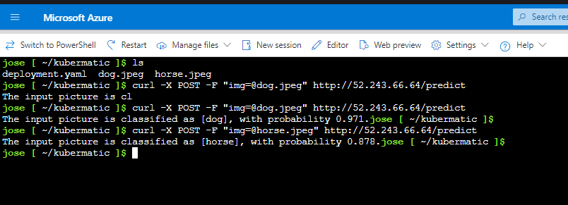

# Primer punto parcial
# -------------------------------------------------------------
#  Para crear un cluster con AKS
Lo primero que se debe hacer es activiar el microsoft.provider, que se encuentra en la siguiente ruta


# Seguido debemos buscar AKS services
Para eso vamos usar la barra de busqueda y escribir AKS, apareceran las siguientes opciones

Seleccionamos la opción que dice services

# Crear cluter
Al ingresar al servicio vamos a seleccionar la opción de crear:


Se debe crear un grupo en caso que no exista, esto con el fin de referenciar y trabajar todos los complementos dentro del mismo grupo


En el apartado de preset configuration, se debe seleccionar el objetivo del cluster con el fin de tener un mejor performance 
Para este caso se uso la primer opción resaltada con el recuadro rojo.


En este apartado se debe dar un nombre al cluster, en este caso se le asigna AKS-EP2-CNUBE, 
Seguido debemos seleccionar la región en la que se desea crear el cluster, en el caso puntual como no deseamos tener tantos recursos del cluster
Seleccionarmos una región con poco trafico, al mismo tiempo se debe tener en cuenta la configuración de los nodos, es decir de los recursos del cluster.


Para la configuración de los nodos seleccionamos la región de Australia pues fue una de las conbinaciones que permitio los siguientes recursos:


Para el apartado de monitoring:
Se dan las siguientes opciones disponibles:


Tags, este apartado te permite generar un tag para un grupo determinado siempre y cuando ya se encuentre creado, de lo contrario se puede dejar por defecto en blanco


Preview + Create. En este último paso se realiza un check de que todos los ítems se encuentren correctamente configurados antes de crear el cluster


# PUNTO DOS DEPLOYMENTE DE https://opensource.com/article/20/9/deep-learning-model-kubernetes
    Primer paso es ingresar con las credenciales previamente creadas 
    ```
    az aks get-credentials --resource-group AKS-EP2-CNUBE --name AKS-EP2-APP
    ```
    Verificar conexión usando 
    ```
    kubectl get nodes
    ```


despues de crear los archivos deployment.yaml y service.yaml se aplican los manifiestos
```
vim deployment.yaml
---------------------------
apiVersion: apps/v1
kind: Deployment
metadata:
  name: deep-learning-deployment
spec:
  replicas: 2
  selector:
    matchLabels:
      app: deep-learning
  template:
    metadata:
      labels:
        app: deep-learning
    spec:
      containers:
      - name: deep-learning-container
        image: <tu-acr>.azurecr.io/deep-learning-model:v1
        ports:
        - containerPort: 5000
        resources:
          requests:
            memory: "512Mi"
            cpu: "500m"
          limits:
            memory: "1Gi"
            cpu: "1"

```
```
vim service.yaml
--------------------------
apiVersion: v1
kind: Service
metadata:
  name: deep-learning-service
spec:
  selector:
    app: deep-learning
  ports:
    - protocol: TCP
      port: 80
      targetPort: 5000
  type: LoadBalancer
```
kubectl apply -f /home/jose/deployment.yaml
kubectl apply -f /home/jose/service.yaml

Verificamos el deployment del servicios

Comando para generar el expose 
```
kubectl expose deployment kubermatic-dl-deployment  --type=LoadBalancer --port 80 --target-port 5000
```
y luego mostramos los servicios creados


```
kubectl get pods
```


```
kubectl get service
```


kubectl get all


prueba 
curl -X POST -F "img=@horse.jpeg" http://20.195.16.122/predict
curl -X POST -F "img=@dog.jpeg" http://20.195.19.195/predict



# Pasos para subir al docker hub

docker tag mi-imagen miusuario/mi-repo:latest

docker push miusuario/mi-repo:latest


curl -X GET http://4.144.140.195:5000/getStudents


curl -X POST http://57.155.30.21/addNewStudent -H "Content-Type: application/json" -d '{ "name" : "Andrea", "id": "1245435", "grade" : 4.6}'  